# DarkDriving-ICRA-2026
DarkDriving is the first real-world day–night aligned autonomous driving dataset using TTPM. It contains 9,538 pairs with centimeter-level alignment and annotations, enabling low-light enhancement and perception tasks. This repo provides key code and data.
The arxiv link to the paper:https://arxiv.org/abs/2603.18067

## Dataset
A real-world paired day-night driving dataset with centimeter-level alignment for low-light enhancement and autonomous driving perception.
### News

- **[2026-03]** DarkDriving paper is available.
- **[2026-05]** Dataset download link is released.

---

### Introduction

**DarkDriving** is a real-world day and night aligned dataset for autonomous driving in dark environments.  
It is designed to support research on low-light enhancement, day-night image translation, and perception robustness for autonomous driving.

Existing low-light enhancement datasets are usually collected in small static scenes by controlling exposure, while many nighttime driving datasets do not provide precisely aligned daytime counterparts. DarkDriving addresses this limitation by collecting real-world driving scenes with precisely aligned daytime and nighttime image pairs.

The dataset is collected in a large-scale closed driving test field using an automated vehicle. A Trajectory Tracking based Pose Matching method is used to obtain highly aligned day-night image pairs.

https://github.com/user-attachments/assets/c3cfe881-e4ac-4753-b6f9-6d00b583acb4


---

### Highlights

- **The first real-world centimeter-level aligned day-night driving dataset** for autonomous driving in dark environments.
- **Real-world driving scenes** collected in a large closed driving test field.
- **9,538 day-night aligned image pairs**.
- **19,076 high-resolution RGB images**.
- **2448 × 2048 image resolution**.
- **2D bounding box annotations** for autonomous driving perception.
- **6 types of road scenes** and **12 types of nighttime lighting conditions**.
- Supports low-light enhancement, day-night image translation, 2D detection, and 3D detection.

---

## Download

The DarkDriving dataset is released for academic research and non-commercial use only.  
Please read and agree to the dataset license before downloading.

| Part | Description | Link |
|---|---|---|
| Full Dataset | 9,538 day-night aligned image pairs | https://pan.baidu.com/s/1_CO9c3wElufrfxnkKVHIkQ?pwd=e5gr  |

---

### Dataset Overview

| Item | Description |
|---|---|
| Dataset Name | DarkDriving |
| Scene Type | Real-world autonomous driving |
| Sensor | Front-view RGB camera |
| Image Resolution | 2448 × 2048 |
| Number of Image Pairs | 9,538 |
| Number of RGB Images | 19,076 |
| Training Set | 5,906 pairs |
| Testing Set | 3,632 pairs |
| Annotation Type | 2D bounding boxes |
| Main Object Class | Car |
| Number of 2D Boxes | 13,184 |
| Road Scene Types | 6 |
| Nighttime Lighting Conditions | 12 |

---

### Dataset Comparison

DarkDriving is different from previous low-light enhancement datasets and nighttime driving datasets.  
Compared with exposure-controlled low-light datasets, DarkDriving focuses on real driving scenes.  
Compared with nighttime driving datasets with rough GPS alignment, DarkDriving provides precisely aligned day-night image pairs.

<p align="center">
  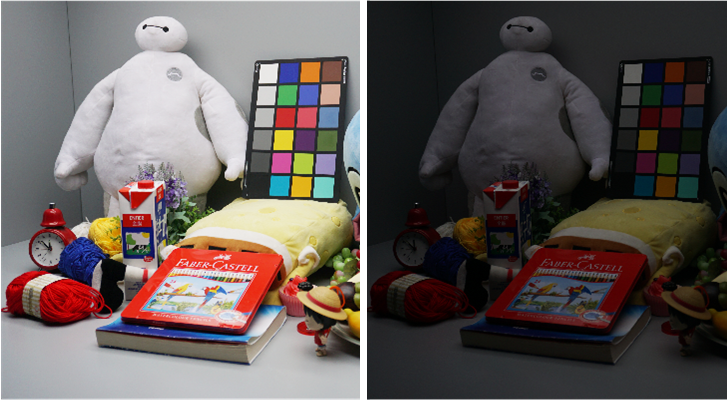
  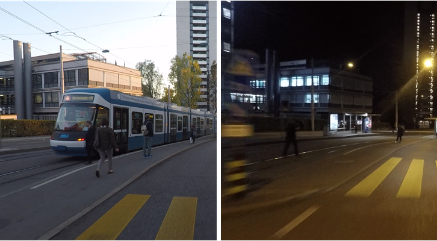
</p>
<p align="center">
  Others
</p>

<p align="center">
  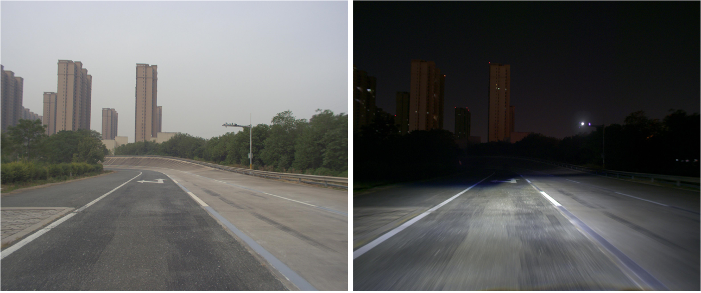
  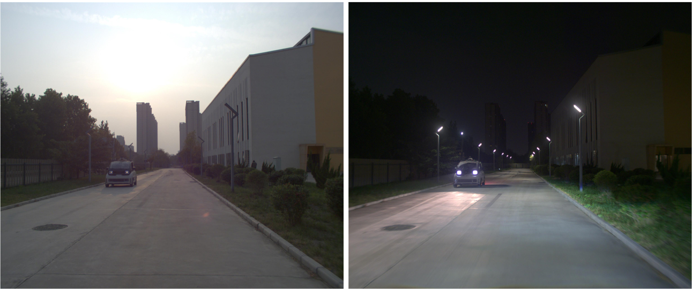
</p>
<p align="center">
  Ours
</p>

<p align="center">
  <b>Comparison with representative low-light and nighttime driving datasets.</b>
</p>

---

### Data Collection

#### Collection Vehicle

DarkDriving is collected using an automated vehicle equipped with a front-view RGB camera, LiDAR, GPS, and IMU sensors.

<p align="center">
  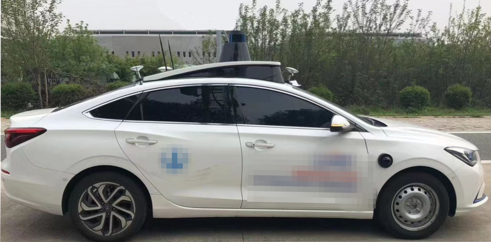
  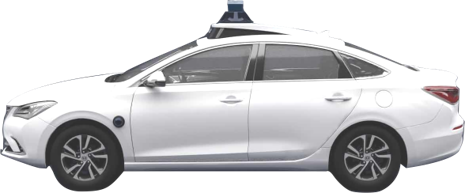
</p>

<p align="center">
  <b>Automated vehicle used for data collection.</b>
</p>

#### Sensor Setup

<p align="center">
  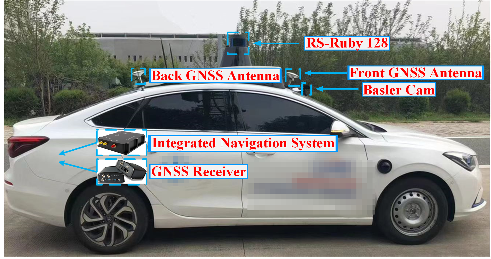
  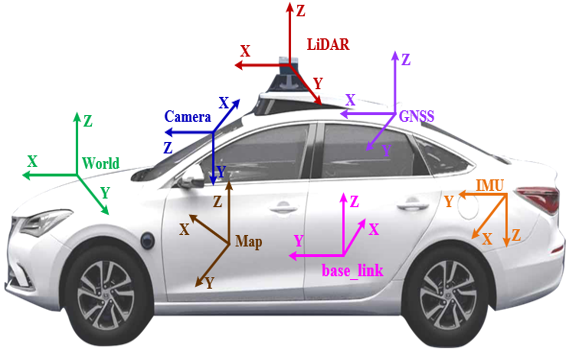
</p>

<p align="center">
  <b>Sensor setup and coordinate system.</b>
</p>

---

### Collection Site

The dataset is collected in a large-scale closed driving test field.  
The closed test field allows us to control static background vehicles, streetlights, and different nighttime lighting conditions.

<p align="center">
  
</p>

<p align="center">
  <b>Large-scale closed driving test field and high-precision map.</b>
</p>

---

### Day-Night Alignment Method

To collect precisely aligned day-night image pairs, we use a **Trajectory Tracking based Pose Matching** pipeline.

The overall pipeline contains the following steps:

1. Build or use a high-precision point cloud map of the test field.
2. Record the desired driving trajectory.
3. Let the automated vehicle follow the same trajectory during daytime.
4. Let the automated vehicle follow the same trajectory during nighttime.
5. Match day and night frames according to vehicle poses.
6. Refine the matched pairs manually to remove mismatched dynamic objects and large alignment errors.

<p align="center">
  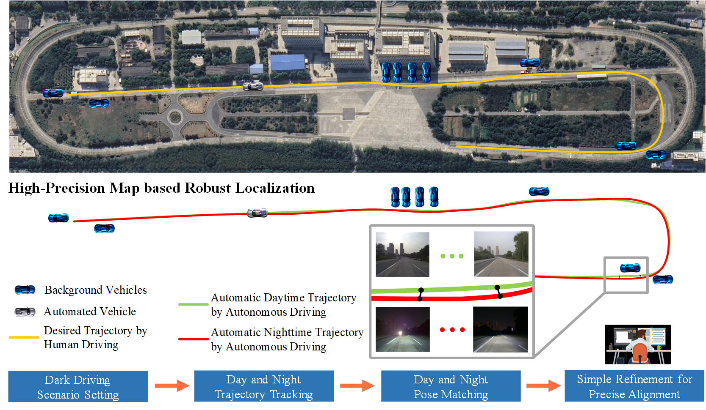
</p>

<p align="center">
  <b>Trajectory Tracking based Pose Matching pipeline for day-night aligned data collection.</b>
</p>

---

### Scenario Diversity

DarkDriving contains diverse road scenes and nighttime lighting conditions.

#### Road Scene Types

<table>
  <tr>
    <th align="center" valign="middle" width="260">Scene Type</th>
    <th align="center" valign="middle" width="120">Percentage</th>
    <th align="center" valign="middle" width="320">Example</th>
  </tr>
  <tr>
    <td align="center" valign="middle"><b>Multi-lane Road</b></td>
    <td align="center" valign="middle">63.3%</td>
    <td align="center" valign="middle">
      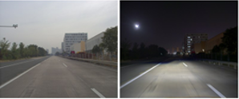
    </td>
  </tr>
  <tr>
    <td align="center" valign="middle"><b>Single-lane Road</b></td>
    <td align="center" valign="middle">16.7%</td>
    <td align="center" valign="middle">
      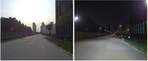
    </td>
  </tr>
  <tr>
    <td align="center" valign="middle"><b>Curved Road</b></td>
    <td align="center" valign="middle">6.5%</td>
    <td align="center" valign="middle">
      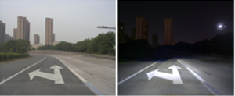
    </td>
  </tr>
  <tr>
    <td align="center" valign="middle"><b>Open Road</b></td>
    <td align="center" valign="middle">2.9%</td>
    <td align="center" valign="middle">
      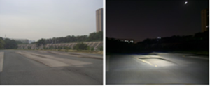
    </td>
  </tr>
  <tr>
    <td align="center" valign="middle"><b>T-intersection</b></td>
    <td align="center" valign="middle">4.7%</td>
    <td align="center" valign="middle">
      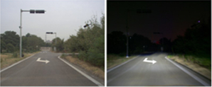
    </td>
  </tr>
  <tr>
    <td align="center" valign="middle"><b>Intersection</b></td>
    <td align="center" valign="middle">5.9%</td>
    <td align="center" valign="middle">
      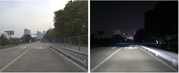
    </td>
  </tr>
</table>

#### Nighttime Lighting Conditions

<table>
  <tr>
    <th align="center" valign="middle" width="260">Lighting Condition</th>
    <th align="center" valign="middle" width="120">Percentage</th>
    <th align="center" valign="middle" width="320">Example</th>
  </tr>
  <tr>
    <td align="center" valign="middle"><b>No Streetlight</b></td>
    <td align="center" valign="middle">50.7%</td>
    <td align="center" valign="middle">
      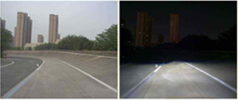
    </td>
  </tr>
  <tr>
    <td align="center" valign="middle"><b>Vehicle Low Beam</b></td>
    <td align="center" valign="middle">5.9%</td>
    <td align="center" valign="middle">
      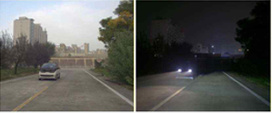
    </td>
  </tr>
  <tr>
    <td align="center" valign="middle"><b>Bilateral Streetlights <br>&amp; Vehicle Low Beam</b></td>
    <td align="center" valign="middle">2.6%</td>
    <td align="center" valign="middle">
      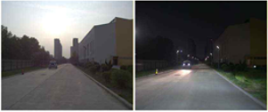
    </td>
  </tr>
  <tr>
    <td align="center" valign="middle"><b>Unilateral Streetlights <br>&amp; Vehicle Low Beam</b></td>
    <td align="center" valign="middle">1.3%</td>
    <td align="center" valign="middle">
      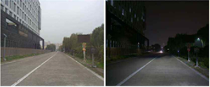
    </td>
  </tr>
  <tr>
    <td align="center" valign="middle"><b>Bilateral Streetlights</b></td>
    <td align="center" valign="middle">6.7%</td>
    <td align="center" valign="middle">
      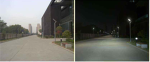
    </td>
  </tr>
  <tr>
    <td align="center" valign="middle"><b>Vehicle High Beam</b></td>
    <td align="center" valign="middle">8.7%</td>
    <td align="center" valign="middle">
      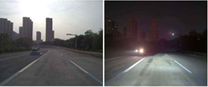
    </td>
  </tr>
  <tr>
    <td align="center" valign="middle"><b>Bilateral Streetlights <br>&amp; Vehicle High Beam</b></td>
    <td align="center" valign="middle">2.3%</td>
    <td align="center" valign="middle">
      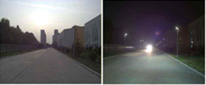
    </td>
  </tr>
  <tr>
    <td align="center" valign="middle"><b>Unilateral Streetlights <br>&amp; Vehicle High Beam</b></td>
    <td align="center" valign="middle">1.8%</td>
    <td align="center" valign="middle">
      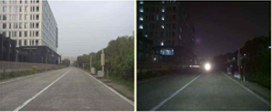
    </td>
  </tr>
  <tr>
    <td align="center" valign="middle"><b>Unilateral Streetlights</b></td>
    <td align="center" valign="middle">8.4%</td>
    <td align="center" valign="middle">
      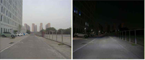
    </td>
  </tr>
  <tr>
    <td align="center" valign="middle"><b>Vehicle Backlight</b></td>
    <td align="center" valign="middle">7.0%</td>
    <td align="center" valign="middle">
      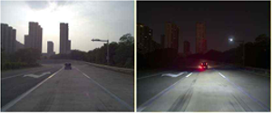
    </td>
  </tr>
  <tr>
    <td align="center" valign="middle"><b>Bilateral Streetlights <br>&amp; Vehicle Backlight</b></td>
    <td align="center" valign="middle">2.9%</td>
    <td align="center" valign="middle">
      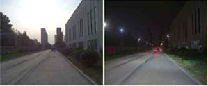
    </td>
  </tr>
  <tr>
    <td align="center" valign="middle"><b>Unilateral Streetlights <br>&amp; Vehicle Backlight</b></td>
    <td align="center" valign="middle">1.7%</td>
    <td align="center" valign="middle">
      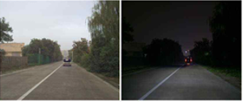
    </td>
  </tr>
</table>

---

## Citation

If you use the **DarkDriving** dataset, annotations, or related code in your research or development, please cite the following paper:

```bibtex
@article{wang2026darkdriving,
  title={DarkDriving: A Real-World Day and Night Aligned Dataset for Autonomous Driving in the Dark Environment},
  author={Wang, Wuqi and Yang, Haochen and Li, Baolu and Sun, Jiaqi and Zhao, Xiangmo and Xu, Zhigang and Guo, Qing and Min, Haigen and Zhang, Tianyun and Yu, Hongkai},
  journal={arXiv preprint arXiv:2603.18067},
  year={2026}
}
```
The arxiv link to the paper:https://arxiv.org/abs/2603.18067

Also, under this LICENSE, DarkDriving is for non-commercial research only. Researchers can modify the source code for their own research only. Contracted work that generates corporate revenues and other general commercial use are prohibited under this LICENSE. 

---

## Contributors

DarkDriving is mainly supported by **[Lab / Institution Name]**.

### Principal Investigator

- Haigen Min, Xiangmo Zhao

### Project Lead

- Wuqi Wang

### Team Members

- **[Name]** 
- **[Name]**
- **[Name]**
- **[Name]** 

### External Collaborators / Acknowledgements

- We would like to thank **[Name / Group / Institution]** for their valuable support in **dataset collection / annotation / experiment design / project discussion**.
- We also acknowledge **[Name / Lab / Institution]** for helpful discussions and collaboration on this project.
